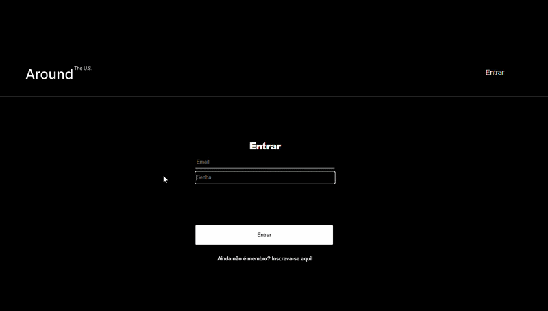
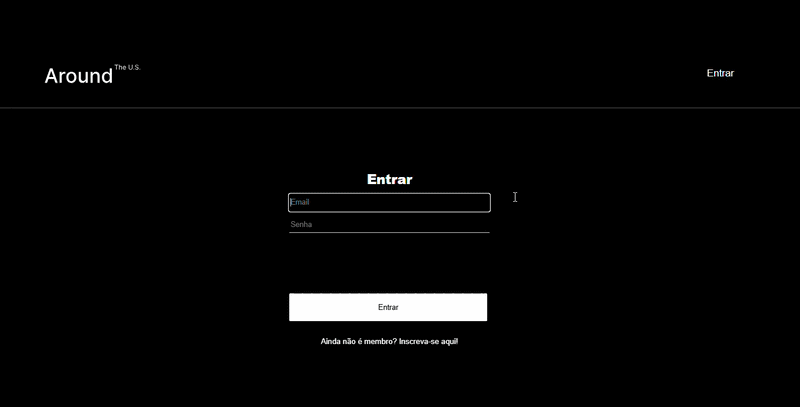

# Tripleten web_project_around_auth

## Live Demo

- https://rodrigomzanetti.github.io/web_project_around_auth/signin

## Description

A full-stack web application that allows users to share photos of places across the United States. This sprint implemented a complete JWT authentication system.

## Features

- New user registration
- Login and logout with JWT
- Protected routes, only authenticated users can access the content
- Session persistence via localStorage
- Visual feedback with success and error popups
- Like and delete cards
- Edit profile and avatar

## Technologies & Techniques

- React (functional components, hooks)
- React Router DOM (routes, navigation, ProtectedRoute)
- Context API (CurrentUserContext)
- JWT (JSON Web Tokens)
- localStorage
- Fetch API
- CSS (BEM methodology)
- Vite

## Link

[GitHub Repository](https://github.com/RodrigoMZanetti/web_project_around_auth)
